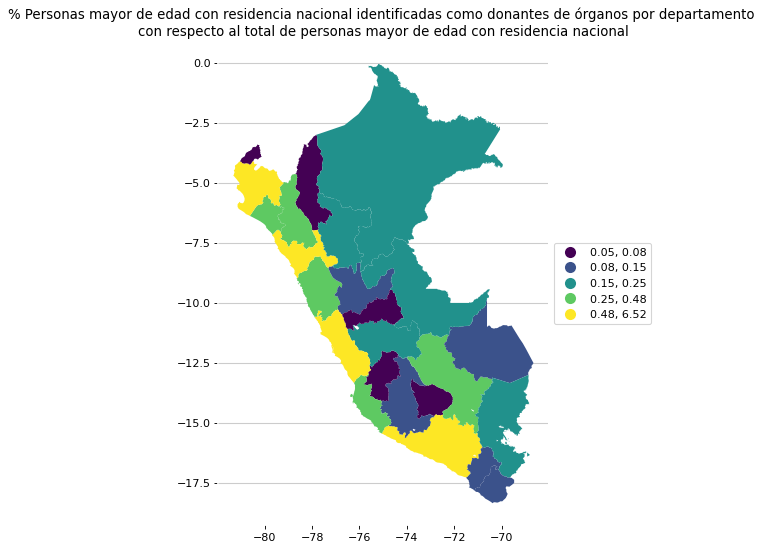

## Población Identificada con DNI Mayor de Edad por Condición de Donante de Órganos, por Sexo y Edad, según Lugar de Residencia

El presente notebook tiene como finalidad realizar un análisis exploratorio del dataset de Donación de Órganos presentado en el Portal Nacional de Datos Abiertos del Perú a cargo de la Secretaría de Gobierno y Transformación Digital del Perú.

El propósito específico es conocer el porcentaje de personas adultas mayores que tienen residencia nacional
y marcaron ser donantes de órganos con respecto al total de personas adultas mayores que tienen residencia nacional.

### **Respuesta como cumplimiento al propósito específico**

#### En el archivo ***analisis.ipynb*** podrás encontrar todo el análisis realizado. ¡Te invito a leer! 👉🏻